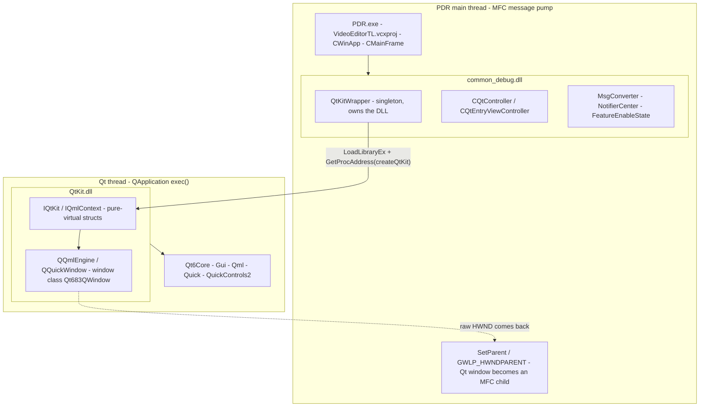
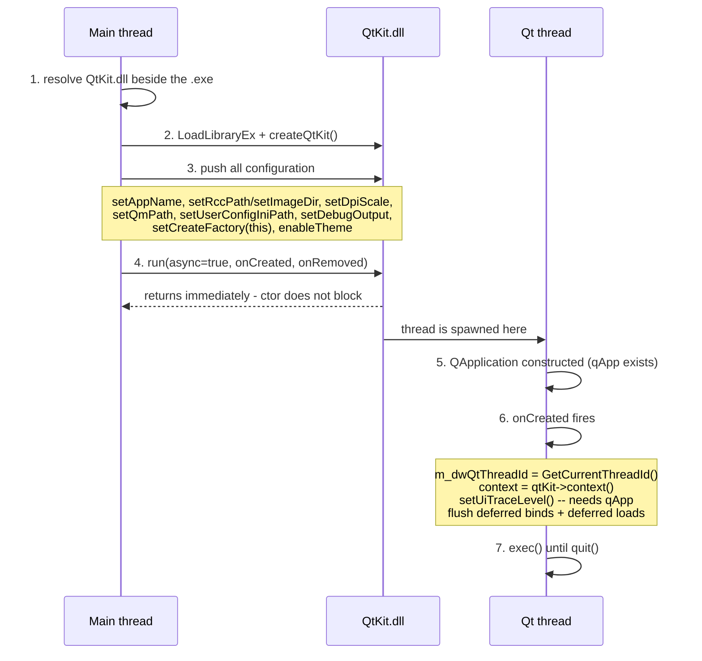
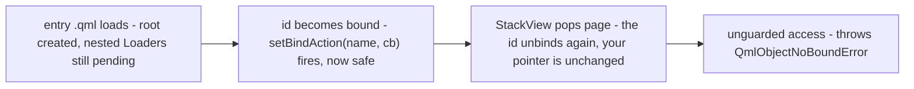
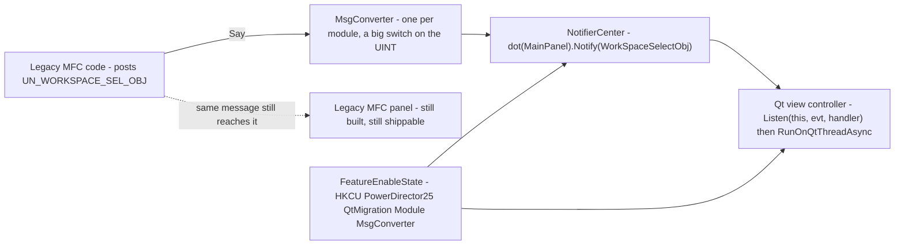

# The QtKit Bridge

How PowerDirector's MFC application hosts a Qt 6 QML user interface in the same
process, on a second thread, behind per-module switches that let both UIs ship
at once.

| | |
|---|---|
| Qt version | 6.8.3 · `msvc2022_64` |
| Bridge | `QtKit.dll` (eModule-delivered) |
| Host | `common_debug.dll` (`common.vcxproj`) |
| Linkage | 2 `extern "C"` exports |
| Verified against | branch `master` @ `e82e4c817e` |

> Rendered version with full diagrams:
> https://claude.ai/code/artifact/7d568ad8-b78b-4a70-b468-ddd410f74bb0

---

## 00 · The one idea

**Qt is not linked into PowerDirector.** Not one Qt header, not one Qt symbol,
not one `moc` pass anywhere in this repo. The entire Qt world is sealed inside
`QtKit.dll`, which PDR loads at runtime with `LoadLibraryEx` and talks to
through exactly two `extern "C"` functions and a set of pure-virtual C++
structs.

That seal is the reason the migration is survivable. MFC's `afxwin.h` and Qt's
`qobject.h` never meet in a translation unit, so there is no macro war over
`signals`, no MFC `DEBUG_NEW` poisoning Qt allocations, and no rebuild of the
product when Qt bumps a patch version.

The price is that every interaction between the two halves has to cross a DLL
boundary **and** a thread boundary. Everything below is about how the codebase
pays that price.

---

## 01 · The shape of the process

One process, two UI threads, three layers of DLL.



**Only one arrow crosses in each direction.** Outbound, PDR reaches Qt through
two C exports. Inbound, Qt hands back a bare `HWND` that MFC reparents like any
other child window. Nothing else is shared — no allocator, no type, no build
flag.

The contract lives in `src/external include/QtKit/Interface.h` — 965 lines of
pure-virtual structs, delivered by eModule alongside the DLL. Two vocabularies
live in it: `IQtKit` and `IQmlContext` for lifecycle and lookup, and roughly
thirty `IUI*` proxies (`IUIButton`, `IUISlider`, `IUIListView`,
`IUITextureView`, ...) standing in for QML item types.

Because the header is a hand-written ABI rather than a generated one, **ordering
matters**. The comment above `setUiTraceOutput` says so outright: the two trace
methods were *appended* to the end of the vtable, never inserted, so a newer
`QtKit.dll` stays compatible with an older PDR build. Add a method in the middle
of one of these structs and you will silently corrupt every call after it.

---

## 02 · Boot — how the Qt thread is born

All of this sits in one constructor, `QtKitWrapper::QtKitWrapper()`, reached the
first time anyone calls `QtKitWrapper::shared()`.



**The window between steps 4 and 6 is real and observable.** `run()` returns
before the context exists, so the wrapper keeps two queues —
`m_listDeferredLoadQml` and `m_mapDeferredBindAction` — and replays them from
the creation callback. Any code you write that touches `IQmlContext` must
tolerate it being null.

Step 6 carries a lesson the code comments at length. `setUiTraceLevel()` was
originally called from the constructor, which looked harmless — and silently did
nothing, because it installs an event filter on `qApp`, and `qApp` does not
exist until the Qt thread constructs it. The fix was to defer the call into the
creation callback.

> **Rule:** anything that touches Qt global state must run in the callback, not
> the constructor.

---

## 03 · Binding — how C++ addresses a QML object

There is no code generation and no `Q_PROPERTY` on the PDR side. Objects are
addressed **by string name**.

```qml
Button {
    objectName: "dpPlayBtn"   // the name is the entire contract
    text: qsTr("Play")
}
```

```cpp
m_pContext->button("dpPlayBtn").setClickedAction([]{ /* ... */ });

if (IsQmlBound("dpPlayBtn"))   // guard before every dereference
    ...
```

`IQmlContext` exposes ~30 typed accessors — `button()`, `slider()`,
`listView()`, `window()`, `textureview()`, ... — each mapping a string to an
`IUI*` proxy.

### The state block

Those accessors carry one value each, which is the wrong shape for a feature's
shared state. PDR's answer is a second pattern: one `UIProperty` singleton per
feature, bound under a **single** name, holding everything that crosses the
boundary.

```qml
// skinQt/qml/VoiceClone/VCProperty.qml  (~87 of these exist, one per feature)
pragma Singleton
UIProperty {
    property bool hasVoiceCloneName:  false   // updated from the QML TextField
    property bool hasVoiceCloneAudio: false   // updated from C++ backend
    property real currentTimeMs:      0.0
    Component.onCompleted: binding = qmlContext.bindProperty(this, VCName.property)
}
```

```cpp
auto& prop = m_pContext->property(VCName.property);
prop.property("currentTimeMs", fMs);                    // typed setters
const bool bReady = prop.propertyBool("hasVoiceCloneAudio");
```

QML binds declaratively to those properties, so C++ writes one value and every
dependent item redraws itself — no per-widget push, and traffic runs both ways
through the same object. Each `*Property.qml` is paired with a `*Name.qml`
holding the strings, and controllers reach it through
`CQtViewController`; see `src/ui/common/Qt/`.

**The root type must be `UIProperty`, not `QtObject`.** A plain `QtObject`
binds without complaint and `isObjectBound()` returns true, but no
`IUIProperty` is left behind it — `context->property(name)` then reports
`The id does not exist` and faults. The asymmetry between the two is the only
symptom you get.

### Why the name may not resolve yet



`QtKitWrapper::PostBindAction()` is the safe wrapper, and its shape explains the
hazard:

```
setBindAction( name, [ postCall( [ if (isObjectBound(name)) action(); ] ) ] )
```

Bind, then defer one turn of the event loop, then re-check — because an async
`Loader` can finish as its owning entry unloads.

**String names make the boundary loose, and the looseness is the hazard.**
Rename an `objectName` in QML and nothing fails to compile; the call simply
throws at runtime, or silently no-ops. This is why
`skinQt/AUTOMATION_ID_NAMING.md` and the audit scripts (`audit_id_coverage.py`,
`check_automation_id.py`) exist — the names are load-bearing, so the repo
polices them mechanically.

---

## 04 · Windows — both directions

### A · QML into MFC (the common case)

1. QML declares `Window { objectName: "dlgWnd" }` — Qt creates a real top-level
   `Qt683QWindow`.
2. `context->window("dlgWnd").window()` returns `void*`, cast straight to `HWND`.
3. Reparent into the MFC tree:
   - modal → `SetWindowLongPtr(hWnd, GWLP_HWNDPARENT, hParent)`
   - docked → `SetParent()` + `SetWindowPos()` (see `FillInParentWnd()`)
4. Install a per-window message hook via
   `pEventFilter->addWindowEventCallback(hQtWnd, ...)`:
   - `WM_SETCURSOR` → swallow (Qt owns the cursor)
   - `WM_MOUSEACTIVATE` → answer `MA_ACTIVATE` here, so the MFC parent never
     gets to veto activation

### B · MFC into QML (webviews, legacy controls)

1. A native control already has an `HWND` (e.g. `QtCGHTMLCtrlHelper` webview).
2. `AttachWindowHost("hostId", hwnd, onDone)` — callable from any thread, hops
   to the Qt thread itself.
3. `context->windowHost("hostId").window(hwnd)`. `IWindowHost` has exactly one
   method; QML then drives geometry and z-order.

> **Ordering trap.** The host only picks up the native window's geometry when
> something changes *afterwards*. Keep the `WindowHost` hidden in QML and flip
> its `ready` flag from the `onDone` callback.

Both directions end up as ordinary Win32 parent/child relationships. There is no
compositing layer, no shared surface, and no Qt widget wrapper — painting,
hit-testing and focus are negotiated by the window manager, which is why the
message hook in A is necessary at all.

---

## 05 · The thread rule

**If you internalise one thing from this document, make it this section.**

MFC objects belong to the main thread. `IQmlContext` and every `IUI*` proxy
belong to the Qt thread. Touching either from the wrong side is undefined
behaviour that usually presents as an intermittent crash on shutdown, not an
assert at the call site.

| Call | Direction | Notes |
|---|---|---|
| `RunOnQtThreadAsync(fn)` | main → Qt | On `CQtViewController` / `CQtController`. Silently drops if the entry is already unloading — that check is the point of it. |
| `RunOnMainThreadAsync(fn)` / `RunOnMainThreadSync(fn)` | Qt → main | On `CQtController`, routed through `CMsgProxy` so it rides the MFC message pump. |
| `context->postCall(fn)` / `context->delayCall(fn, ms)` | Qt → Qt | Already on the Qt thread, but yield a turn of the event loop first. How `PostBindAction` dodges the unload race. |
| `QtKitWrapper::shared()->isQtThread()` | assert | Cheap. Use it liberally while learning. |

Three lifecycle hooks let a view controller work at the right moment on the
right thread: `OnQmlDidLoad`, `OnQmlWillUnload`, `OnQmlDidUnload`. Between the
last two, `ShutDownQtExecutor()` runs and pending hops are discarded — that is
what keeps a queued lambda from firing into a destroyed controller.

> **Read the comments as a change log.** `CQtEntryViewController` records real
> shipped bugs. One names an eBug outright: dismissing a Qt window while the MFC
> main window was disabled let Windows hand the foreground to another
> application, so PowerDirector appeared to minimise itself. The fix —
> re-enable and re-foreground the owner *before* dismissing — sits in
> `OnQmlWillUnloadImp`.

---

## 06 · Dual-mode — shipping both UIs at once

Each migrated panel exists twice. A registry value picks which one runs, per
module, at startup.



Read `src/ui/common/MigrateCandy.h` early — it is the migration's lingua franca.
`Say(evt, param)` publishes, `Listen(this, evt, fn)` subscribes, and the
`QDP_event` / `QSP_event` / `QLIB_event` namespace aliases keep call sites
short. The file's name is a joke about syntactic sugar, but it is genuinely the
front door.

### Which modules are live today

Straight out of `src/ui/common/QtMigration/FeatureEnableState.cpp`. The two
`OFF` rows read `reg.Load() && reg` rather than `reg.Load() ? reg : true`, so an
absent key means off:

| Module | Registry sub-key & value | Default | Meaning |
|---|---|---|---|
| DisplayPanel | `DisplayPanel\MsgConverter` | **ON** | Preview area is QML |
| SettingPanel | `SettingPanel\MsgConverter` | **ON** | Clip settings are QML |
| TipsArea | `TipsArea\MsgConverter` | **ON** | |
| Library | `Library\MsgConverter` | **ON** | Media room is QML |
| SubtitleRoom | `Library\SubtitleRoom` | **ON** | Nested under Library |
| ColorMatch | `ColorMatch` | **ON** | At the QtMigration root |
| Timeline | `Timeline\MsgConverter` | *OFF* | MFC ruler still live, kept in sync |
| StageSettingPage | `SettingPanel\IsStageEnabled` | *OFF* | In progress |

Full registry root: `HKEY_CURRENT_USER\Software\CyberLink\PowerDirector25\QtMigration\`

The timeline is the one still to fall, and its comment says exactly where things
stand: *"TRUE once the Qt timeline replaces the MFC timeline ruler. While FALSE
the MFC ruler is still alive and is kept in sync."* That dual-maintenance burden
is the current cost centre of the migration.

---

## 07 · Resources — from .qml to .rcc

Everything under `skinQt/` is collected by `qrcGen.py` into a generated
`skinQt.qrc`, then compiled by Qt's `rcc.exe` into a single `skinQt.rcc`.
`skinQt/rcc.bat` is the whole build step, and it hardcodes the toolchain path:

```bat
python ./qrcGen.py
C:\Qt683\6.8.3\msvc2022_64\bin\rcc.exe ./skinQt.qrc -o ./skinQt.rcc -binary --threshold 0
```

At startup the wrapper forks on the file's presence:

| State | Behaviour |
|---|---|
| `.rcc` found | `setRccPath()`, `isRccFileReady() == true`. Entries load as `":/qml/Dialog/Foo.qml"`. Shipping builds. |
| no `.rcc` | `setImageDir()` points at `../../skinQt/media`. Entries load from disk. Edit QML and restart, no rebuild. |

**That fork is why every entry controller is constructed with two paths:**

```cpp
CQtEntryViewController(pController, strSkinQml, strRccQml, strQtWndId)
```

It takes the filesystem path *and* the `:/` path, and picks between them based
on `isRccFileReady()`. Pass a mismatched pair and the dialog works on your
machine and fails in the installer.

The loose-file mode is the one you want while developing a panel: delete or
rename `skinQt.rcc` next to the executable and QML is read from the working
tree, so an edit costs a restart instead of a build.

---

## 08 · Two things that will confuse you

Both verified against the tree at `e82e4c817e`. Neither is mentioned in the docs.

### 1. A Debug build loads the *release* QtKit

`QtKitWrapper.cpp` and `QtKitWrapper.h` both branch on `#ifdef DEBUG` to choose
`QtKitd.dll` over `QtKit.dll`, and to choose the `Qt683dQWindow` class name over
`Qt683QWindow`.

No project in this repo ever defines bare `DEBUG`. MSVC's macro is `_DEBUG`, and
that is what all fifteen `.vcxproj` files set. So the branch is dead: **even
`Debug|x64` loads the release `QtKit.dll`.** `QtKitd.dll` ships to
`bin_x64\PowerDirector\` at 5.2 MB and is never opened through this path.

Practical effect: you cannot step into QtKit's debug build without defining
`DEBUG` yourself. Do not "fix" this casually — flipping it changes which Qt6
DLLs get loaded process-wide.

### 2. AGENTS.md names the wrong registry root

`AGENTS.md` documents the dual-mode switch under
`...\CyberLink\PowerDirector24\QtMigration\Library`. The current root is
**`PowerDirector25`** — `STR_PDR_FULL_NAME` in
`src/ui/definition/PDRPathDef.cpp:16`. `PowerDirector24` is now the first entry
in `STR_PDR_FULL_NAME_PREV`, the list used for settings migration from older
installs.

If you set the key by hand and nothing changes, this is why.

---

## 09 · Where to read next

In this order. Each one is short.

| Path | Why |
|---|---|
| `src/external include/QtKit/Interface.h` | The whole contract. Skim `IQtKit` and `IQmlContext`; ignore the thirty `IUI*` structs until you need one. |
| `src/ui/QtKitWrapper/QtKitWrapper.cpp` | 446 lines, and the only place the DLL is loaded. Read the constructor and `run()`. |
| `src/ui/common/MigrateCandy.h` | The `Say` / `Listen` vocabulary every migrated module speaks. |
| `src/ui/common/Qt/QtViewController.cpp` | Entry/sub view-controller lifecycle, HWND reparenting, the event filter. |
| `src/ui/common/QtMigration/FeatureEnableState.cpp` | 80 lines. The complete list of what is switched on. |
| `src/ui/displaypanel/QtDisplayPanel/` | A finished module to copy the shape from — `Controller/`, `Model/`, `Helper/`, with the legacy panel beside it as `LegacyDisplayPanel.h`. |
| `skinQt/AUTOMATION_ID_NAMING.md` | Naming rules for the strings that hold the binding together. |
