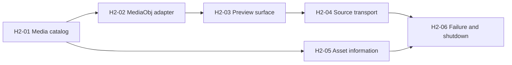

# Homework-2 plan: MediaObj source player

## Status

Active plan proposed on 2026-09-21. It supersedes the earlier timeline-editor
execution order for Homework-2. The M0-M5 documents remain the deferred PDR
engine-integration backlog.

## Scope

Homework-2 is a simple source-media player:

- import and select one asset from a media library;
- use MediaObj for source playback only;
- play, pause, stop, and seek the selected source;
- display asset information in the Properties panel;
- show image, video, audio-only, invalid, and missing-media states clearly.

There is no timeline, no composition, no editing commands, no effects, and no
SIMBA dependency. The Properties panel is read-only asset information for this
homework.

## Why the plan changed

Registration-free COM activates MediaObj from both the private build directory
and beside `PDR.exe`. SIMBA construction faults with `0xC0000005` in both
locations. Source playback through MediaObj is the smallest real playback
feature with an independently verified activation path.

## Delivery sequence

| Ticket | GitHub issue | Outcome |
|---|---:|---|
| H2-01 | #27 | Media catalog and selected asset state |
| H2-02 | #32 | MediaObj source adapter and lifetime boundary |
| H2-03 | #30 | Native preview surface decision and implementation |
| H2-04 | #31 | Play, pause, stop, and seek for one source |
| H2-05 | #29 | Read-only asset information Properties panel |
| H2-06 | #28 | Invalid input, replacement, close, and shutdown checks |

### H2-01 - Media catalog

Import and classify file paths, retain stable media IDs, and publish selected
asset state to QML. This project-owned model does not use a timeline.

### H2-02 - MediaObj adapter

Create a narrow source adapter that owns MediaObj COM lifetime, load/unload,
metadata, and normalized error results. The adapter must keep proprietary
interfaces out of controllers and QML.

### H2-03 - Preview surface

Choose and verify the smallest MediaObj preview path. The preferred initial
route is a native child `HWND` hosted over the preview region; a callback route
requires separate evidence before use.

### H2-04 - Source transport

Connect play, pause, stop, seek, duration, and position to the selected asset.
Engine position is authoritative; the UI does not invent playback progress.

### H2-05 - Asset information

Replace transform and effect controls with read-only filename, media type,
duration, dimensions, frame rate when available, and stream capabilities.

### H2-06 - Failure and shutdown

Cover invalid and missing media, audio-only and image states, replacement while
playing, close during load or playback, and repeated load/close cycles.

## Deferred work

SIMBA composition, a timeline, editing commands, effects, and project
persistence are outside Homework-2. They may be planned only after a
product-owned SIMBA adapter has a complete runtime package and a safe
lifecycle proof.

## Verification

| Rule | Requirement |
|---|---|
| VR-MEDIA-01 | Video, audio, image, invalid, and missing inputs expose correct source metadata/status. |
| VR-PREVIEW-01 | The selected preview route survives resize, hide/show, and source replacement. |
| VR-TRANSPORT-01 | UI transport state follows MediaObj results and authoritative position. |
| VR-LIFE-01 | Twenty load/play/close cycles have no hang or surviving process. |
| VR-RUNTIME-01 | The opt-in proprietary probe reports its stage without affecting startup. |
