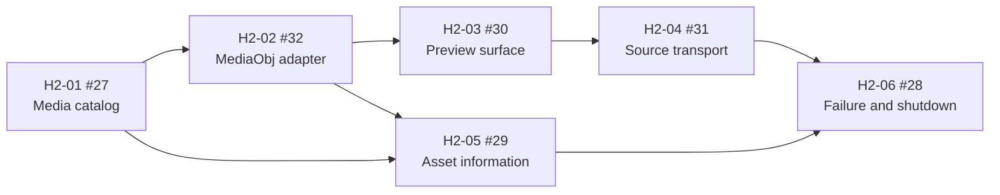

# Homework-2 issue graph

The active GitHub milestone is **Homework-2 - MediaObj source player**.
Existing pre-H2 issues are retained as historical investigation evidence; they
are not dependencies of this delivery scope.

| Ticket | Issue | Deliverable | Depends on |
|---|---:|---|---|
| H2-01 | #27 | Import, media classification, stable ID, and selected-asset state | None |
| H2-02 | #32 | MediaObj owner with load/unload, metadata, and normalized errors | H2-01 |
| H2-03 | #30 | Verified native preview surface | H2-02 |
| H2-04 | #31 | Play, pause, stop, seek, duration, and source position | H2-03 |
| H2-05 | #29 | Read-only filename, type, duration, dimensions, frame rate, and streams | H2-01, H2-02 |
| H2-06 | #28 | Replacement, failure, and shutdown coverage | H2-04, H2-05 |

## Rules

- Each issue owns one observable result and the verification evidence stated in
  `VERIFICATION.md`.
- Controllers and QML never hold MediaObj interfaces.
- Any new proprietary call remains inside the H2-02 adapter boundary.
- SIMBA, timeline, editing, effects, and persistence require a separate future
  plan; they are not reopened through an H2 ticket.
