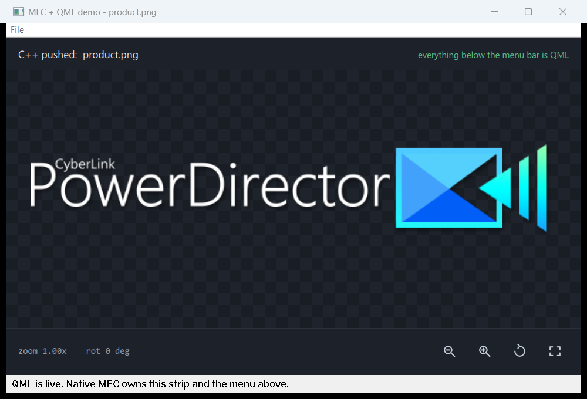

# MFC + QML demo

A ~600-line working program that does what PowerDirector does: an MFC
application loads `QtKit.dll` at runtime, starts Qt on a second thread, adopts
the QML window's `HWND` into its own frame, and talks to QML across the
boundary in both directions.



The native MFC parts are the title bar, the **File** menu, and the white status
strip at the bottom. Everything between them is QML, rendered by a
`QQuickWindow` that is an ordinary Win32 child of the MFC frame.

**Built and run successfully.** The screenshot above is this program, and every
claim below was verified at runtime, not by inspection.

---

## What it demonstrates

| | Direction | Mechanism |
|---|---|---|
| **File > Open Image...** puts a picture on the QML canvas | C++ &rarr; QML | `context->image(name).source(fileUrl)` on the Qt thread |
| The caption reads `C++ pushed: <filename>` | C++ &rarr; QML | same, second bound Label |
| Clicking a QML button updates the native status strip | QML &rarr; C++ | `context->button(name).setClickedAction(...)`, then `PostMessage` to the MFC thread |
| Zoom / Rotate transform the image | QML &rarr; C++ &rarr; QML | the button reports intent, `CDemoController` applies the rule, `context->property(name).property("zoomFactor", f)` writes the result back, and QML's own bindings redraw |

Verified round trip, from the live process:

```
status BEFORE: '  QML is live. Native MFC owns this strip and the menu above.'
status AFTER : '  QML "Rotate 90" -> C++ decided: zoom 1.50x, rot 90 deg  (3 clicks)'
```

Note what the "after" line proves: C++ is reporting the zoom and rotation from
its **own** members. It never asks QML what the numbers are, because it is the
side that decided them. The matching log, after Zoom in twice then Rotate:

```
PublishState: zoom=1.25 rot=0  (readback zoom=1.25 rot=0)
PublishState: zoom=1.50 rot=0  (readback zoom=1.50 rot=0)
PublishState: zoom=1.50 rot=90 (readback zoom=1.50 rot=90)
```

And the window tree, proving the adoption is a real Win32 parent/child:

```
TOP    class=AfxFrameOrView140ud   'MFC + QML demo'      <- MFC frame
  CHILD class=Qt683QWindowIcon     'QML canvas'          <- QQuickWindow, reparented
  CHILD class=Static               'QML is live...'      <- native strip
```

---

## How the layers split

```
CMainFrame             MFC and nothing else: menu, status strip, file
      |                dialog, layout.
      v
CDemoController        The state and the rules. Owns zoomFactor and
      |                rotationDeg, clamps to 0.1-4.0, steps rotation by 90.
      |                Knows nothing about QML ids or HWNDs.
      v
CDemoViewController    The QML adapter. Loads the .qml, adopts the HWND,
      |                wires bindings, hops threads. Holds no feature state.
      v
DemoWindow.qml         Presentation. Reads DemoProperty.*; the buttons
DemoProperty.qml       report intent and decide nothing.
```

| This demo | PDR | Base class |
|---|---|---|
| `CDemoController` | `CDCController` | `CQtController` / `CQtModalController` |
| `CDemoViewController` | `CDeductCreditVC` | `CQtEntryViewController` |
| `DemoProperty.qml` | `VCProperty.qml` | `UIProperty` |
| `DemoName.qml` | `VCName.qml` | - |

Note that this is **not** textbook MVC, despite PDR's folders being literally
`Model/ View/ Controller/`. The view controller is the piece textbook MVC does
not have, and it is the one that earns its keep: the C++/QML boundary is
string-keyed, across a DLL, across a thread, and the VC is the only file on the
C++ side that knows any of that. Rename a QML id and exactly one file changes.
`CDeductCreditVC` is the shape to copy - its entire body is a constructor
naming the `.qml` plus an `OnQmlDidLoad()` attaching two clicked actions.

The ratio is the giveaway: PDR has **380** `*Controller.h` against **96**
`*VC.h`. Most controllers never front QML at all, which is only possible
because the rules do not live in the adapter.

> **Earlier versions of this demo did not do this.** Zoom and rotation were
> `property real` on the root `Window`, QML applied its own clamp, and C++ was
> told a button had been pressed without being told - or deciding - what it
> meant. The [git history](../..) has that version if the contrast is useful.

---

## Build and run

The demo *runs* from its **own self-contained folder**, `mfc_qml_demo\bin_x64\`
- once staged, it loads zero modules from `bin_x64\PowerDirector\`. It does not
*build* standalone; see [the two out-of-folder dependencies](#housekeeping)
below. Stage the runtime once, then build:

```bat
cd qt-homework\mfc_qml_demo
powershell -ExecutionPolicy Bypass -File .\stage_runtime.ps1
msbuild MfcQmlDemo.vcxproj /p:Configuration=Debug /p:Platform=x64
bin_x64\MfcQmlDemo.exe
```

`stage_runtime.ps1` copies the minimum runtime set out of
`bin_x64\PowerDirector\` - see [the inventory below](#what-it-actually-needs-at-runtime).
Re-run it after `emma` updates QtKit or the Qt6 DLLs; `-Clean` wipes the staged
files first, `-Verify` prints the resulting tree.

Open it in Visual Studio 2022 and F5 works too (there is no `.sln`; VS builds
a bare `.vcxproj` fine). There is **no Qt SDK requirement** - the only QtKit
header is `Interface.h`, and the DLL is reached through `LoadLibraryEx`, so the
demo needs only what a successful PDR build already put on disk.

That header is **not** copied into this folder. It is the PDR working copy's
own `src\external include\QtKit\Interface.h`, picked up through
`AdditionalIncludeDirectories = $(ProjectDir)src;$(ProjectDir)..\..\src`. Move
this folder somewhere that is not two levels below a PDR checkout and the
compile breaks on the missing include.

Optional: pass an image path to skip the file dialog.

```bat
bin_x64\MfcQmlDemo.exe "C:\pictures\cat.png"
```

Startup traces to **`%TEMP%\MfcQmlDemo.log`**, one line per step with the thread
id, which is the easiest way to watch the thread hop happen:

```
[tid 40808] run() returned, ctor thread continues
[tid 25128] context created -> 000002153CE26010      <- different thread
[tid 25128] IQmlContext::load -> ok
[tid 25128] bound? window=1 property=1 caption=1 imagePath=1 zoomIn=1 reset=1
[tid 25128] reparented under 0000000000230B06
```

---

## What it actually needs at runtime

**116 files, 56 MB**, verified by running the demo and reading `Process.Modules`
of the live process - not guessed from a dependency walker. The staged folder
loads **zero** modules from `bin_x64\PowerDirector\`; it is genuinely
standalone.

| Group | Size | Why |
|---|---|---|
| `QtKit.dll` | 2.0 MB | The bridge. The only DLL the demo touches directly. |
| `Qt6Core/Gui/Qml/Quick` | 25.8 MB | QtKit links these; they must sit beside it. `Qt6Gui` alone is 8.9 MB. |
| `Qt6Network`, `Qt6OpenGL`, `Qt6Svg`, `Qt6Qml{Meta,Models,WorkerScript}` | 4.9 MB | Pulled in by QtKit's network cache, the scene-graph backend, and the SVG image plugin. |
| `Qt6QuickControls2*`, `Qt6QuickTemplates2` | 3.4 MB | Only because the QML uses `Button` and `Label`. Stick to plain QtQuick items and this group goes away. |
| `platforms\qwindows.dll` | 1.0 MB | **Mandatory.** Without this exact path Qt aborts with "no Qt platform plugin could be initialized" - the classic Qt packaging mistake. |
| `imageformats\*.dll` (5) | 2.0 MB | One per format you open. PNG and BMP are built into `Qt6Gui` and need no plugin. `qsvg.dll` is no longer optional, though: the four button icons are SVGs, so the UI itself stops rendering without it. |
| `qml\QtQuick\**` (84 files) | 2.0 MB | Module resolution for `import QtQuick`. Each module needs its plugin DLL **and** its `qmldir` / `.qmltypes`; DLLs alone leave Qt unable to resolve the import. 70 of those files are the Basic style's `.qml` sources. |
| `mfc140ud.dll` | 10.7 MB | Debug MFC. Release swaps in `mfc140u.dll`. |
| `MSVCP140*`, `VCRUNTIME140*` | 2.1 MB | The C++ runtime, debug and release. |

Three things the inventory taught me:

- **The Qt side is release even in a Debug build.** PDR ships `Qt6Core.dll` and
  `Qt6Cored.dll` side by side, and only the MFC/CRT DLLs differ between our two
  configurations. That follows from the dead `#ifdef DEBUG` in `QtKitWrapper`
  (gotcha 1 below) - we mirror it deliberately so the demo and the product load
  the same binary.
- **`qml\QtQuick\qtquick2plugin.dll` is not needed.** Its `qmldir` declares it
  `optional plugin`, and QtKit links `Qt6Quick` statically, so the types are
  already registered when the import resolves. Verified by deleting it.
- **No `qt.conf` anywhere.** Qt finds `platforms\`, `imageformats\` and `qml\`
  relative to the `.exe`, which is the whole reason this folder layout works.

---

## Files

| File | What to read it for |
|---|---|
| `src/QtKitHost.cpp` | The bridge. `LoadLibraryEx` &rarr; `createQtKit` &rarr; configure &rarr; `run(async)`. This is `QtKitWrapper.cpp` with everything non-essential removed. |
| `src/MainFrame.cpp` | The MFC side and only the MFC side: menu, status strip, file dialog, layout. |
| `src/DemoViewController.cpp` | The QML adapter: adopting the `HWND`, wiring bindings, and both thread hops. Marked with a hard `QT THREAD` / `MFC MAIN THREAD` divider. Holds no feature state - PDR's `CQtEntryViewController` in miniature. |
| `src/DemoController.cpp` | The state and the rules: zoom clamps, the 90-degree step, and `PublishState()`. Knows nothing about QML ids or `HWND`s. PDR's `CQtController` in miniature. |
| `src/DemoNames.h` + `qml/DemoName.qml` | The shared name table, mirrored on both sides. This is the whole binding contract. |
| `qml/DemoWindow.qml` | The QML entry: `bindWindow`, `bindLabel`, `bindImage`, `bindButton`, and `binding.clicked()`. |
| `qml/DemoProperty.qml` | The shared state block, `bindProperty`. The root type must be `UIProperty`; see the note below. |
| `qml/DemoImageButton.qml` | The image button, a miniature of `skinQt/qml/Widgets/TintImageButton.qml`. Read it for why the root stays a Controls `Button`. |
| `qml/DemoTintEffect.qml` + `qml/shaders/` | The `ShaderEffect` that recolours a white icon per state, and the two baked `.qsb` shaders it needs. |
| `qml/images/*.svg` | Four hand-drawn monochrome icons. They are tint masks, not finished art - only their alpha survives. |
| `src/DemoApp.cpp` | A plain `CWinApp`. Notable only for the DPI-awareness call, which matters more than it looks. |
| `stage_runtime.ps1` | The runtime manifest, one commented group per dependency. Read this to learn what hosting QML actually costs. |

---

## Eight things that cost me a build cycle each

These are the real findings. Every one of them presented as a silent failure or
an access violation, never as a useful error message.

**1. `setCreateFactory()` is mandatory.** QtKit dereferences the factory while
building the QML context. Omit it and you get `0xC0000005` before any of your
code runs. All five delegates may return `nullptr` - the factory itself just
has to exist.

**2. So are the two ini paths.** `setUserConfigIniPath()` and
`setDontShowAgainIniPath()` are not optional conveniences; QtKit writes
`QSettings` through them at startup.

**3. Adopt on load-complete, not on `setBindAction`.** Hanging the adoption off
`setBindAction(window)` looks equivalent and is not: QML runs
`Component.onCompleted` per object, so the window's bind action fires while
objects further down the tree are still unbound. `IQmlContext::load()` returns
only after the whole tree is built. PDR takes the same route -
`QtKitWrapper::load(path, onComplete, onFail)`.

**4. `isObjectBound()` before every accessor.** The accessors do not return
null for an unknown name. QtKit logs `The id (x) does not exist` and hands back
a reference you then fault on. This is why PDR's controllers are littered with
`IsQmlBound()` calls - it is not defensive programming, it is required.

**5. DPI awareness is not cosmetic.** Qt is per-monitor DPI aware. If the MFC
host is not, Windows virtualises the host's coordinates - ask for a 1000x680
frame on a 125% display and get an 800x544 window - while Qt renders the scene
at the monitor's true scale. The two then disagree about what a pixel is, and
neither `SetWindowPos` nor `IUIWindow::setPosition` can reconcile them; the
scene renders larger than its own window and the controls row falls off the
bottom. `SetProcessDpiAwarenessContext(PER_MONITOR_AWARE_V2)` in `InitInstance`
fixes it. PDR is DPI-aware via its manifest and feeds QtKit
`dpiApp / dpiDisplay` from `CDpiMgr`.

**6. Don't give the root QML `Window` a literal size.** A literal `width: 1000`
wins over `IUIWindow::setPosition()`, the scene stays at its declared size, and
anchored content renders below the visible area. Let the host size it.

**7. `bindImage` works on a stock `QtQuick.Image` - but only if QML reads the
value back.** `IUIImage::source()` does *not* write through to the item's own
`source` property the way `IUILabel::text()` writes through to a `Label`'s
`text`. It sets `source` on the `UIImage` proxy that `bindImage()` returns, and
QML has to bind to it declaratively:

```qml
Image {
    property UIImage binding                    // UIImage comes from import QtKit
    source: binding ? binding.source : ""       // <- the readback. Omit it and nothing appears.
    Component.onCompleted:   binding = qmlContext.bindImage(this, DemoName.photo)
    Component.onDestruction: qmlContext.unbind(this, DemoName.photo)
}
```

Miss that one line and the call looks silently dropped: `isObjectBound()`
returns true, nothing is logged, and the picture never appears - the same shape
as #8, where the bind succeeds and the effect goes nowhere. The asymmetry with
`bindLabel`, which needs no readback, is what makes it easy to misdiagnose.

**All 10 `bindImage` sites in `skinQt` use this readback**, and all 10 bind a
plain `QtQuick.Image` (or a `ScaledImage` wrapping one);
`Dialog/AboutDialog/AboutDialogContentRegion.qml` is the smallest example.
QtKit does register its own `FileImageItem` / `StateImageItem` /
`WebpImageItem`, but **`skinQt` uses none of them** - zero occurrences across
1216 `.qml` files - so they are not required for `bindImage` and never were.

> An earlier revision of this demo routed the URL through a hidden bound
> `Label` and blamed the missing picture on those QtKit-only item types. That
> diagnosis was wrong; the readback was the whole problem. The workaround is
> gone and the `demo.imagePath` name with it.

**8. `bindProperty` needs a `UIProperty` root, not a `QtObject`.** This one
looked like a packaging limitation and was not. Bind a plain `QtObject` full of
declared properties and the *name* registers -
`isObjectBound("demo.property")` returns **true** - but nothing leaves an
`IUIProperty` behind it, so `context->property("demo.property")` reports
`The id does not exist` and then faults. That asymmetry between `isObjectBound`
and the accessor is the tell, and it is easy to misread as "loose files cannot
do this". Declare the singleton as `UIProperty` (it comes from
`import QtKit`) and both sides agree. Every one of the ~87 `*Property.qml`
files in `skinQt` is a `UIProperty`; not one is a `QtObject`. **No `.rcc`
packaging is involved** - this demo binds it from a loose file on disk.

---

## How the buttons are built

The four controls are icon buttons, and PDR offers two patterns for that. The
demo takes the newer one; the choice is worth understanding because the older
pattern is still all over `skinQt`.

| | `ImageButton.qml` (legacy) | `TintImageButton.qml` (used here) |
|---|---|---|
| Art per button | four PNGs - `_n` `_h` `_p` `_d` - doubled again as `_2x` for high DPI | **one** monochrome SVG |
| How state shows | swaps the file on hover/press/disable | a `ShaderEffect` recolours the same texture |
| How art is loaded | `image://Media/...`, a C++ `IUIImageProvider` | a loose file next to the `.qml` |
| Extra runtime cost | the provider must be registered from C++ | two `.qsb` files, 2.2 KB |

The second column is why this demo can have icon buttons at all. Its
`ICreateFactory` returns `nullptr` for every delegate, so there is no image
provider and the `image://Media/` scheme resolves to nothing. A tinted SVG
needs no provider.

Three things worth knowing before copying this:

- **The root must stay a Controls `Button`.** `bindButton()` attaches to it and
  `IUIButton::setClickedAction()` rides the `Button`'s own `clicked` signal.
  Rebuild it as an `Item` + `MouseArea` and the event channel dies while
  `isObjectBound()` keeps returning true - failure mode #7 and #8 all over again.
  Everything below `tip:` in `DemoWindow.qml` is unchanged from the text-button
  version, which is the proof that the swap is skin-deep.
- **`ShaderEffect` costs no new DLL.** It lives in `Qt6Quick.dll`, already
  staged. The obvious Qt 6 alternative, `MultiEffect`'s `colorization`, would
  have pulled in `Qt6QuickEffects.dll` and its whole QML module.
- **`.qsb` is compiled bytecode.** `src` and `tint` in `DemoTintEffect.qml` are
  the names `tint.frag.qsb` was built against. Rename either and the shader
  silently renders nothing - there is no source for Qt to re-resolve against.
- **`DemoImageButton` needs no `qmldir` entry.** A `.qml` file in the same
  folder as its user resolves through QML's implicit directory import, and that
  keeps working even though `qml/` already has a `qmldir`. I assumed the
  opposite, listed both components, then tested it by taking them back out -
  the QML still loads and every id still binds. Every `qmldir` in `skinQt`
  lists singletons and nothing else, which is the same answer from the other
  direction.

Verified from the running process rather than by eye: sampling the icon pixels
gives `195,204,216` - exactly `colorNormal` - and no pure white anywhere, so
the white SVG really is being recoloured and not merely drawn.

---

## What this demo does not show

**The `IEventFilter` message hook** that PDR installs per window to swallow
`WM_SETCURSOR` and answer `WM_MOUSEACTIVATE`, the `MsgConverter` /
`NotifierCenter` event plumbing, and unload/teardown beyond the minimum. See
[../doc/QTKIT_ARCHITECTURE.md](../doc/QTKIT_ARCHITECTURE.md) sections 04 and 06.

**Sub-view controllers.** A real feature splits into one
`CQtEntryViewController` plus a `CQtSubViewController` per panel, attached with
`AttachSubViewController()`. One window needs no such split.

**`skinQt.rcc` packaging.** Shipping builds compile their QML into a resource
and load `qrc:/qml/...`; every PDR view controller is constructed with both a
loose path and an `qrc:` path and picks on `isRccFileReady()`. This demo only
ever takes the loose-file branch.

**Everything `IUIProperty` can carry beyond two numbers** - `setJsonAction` /
`notifyJsonEvent` for structured payloads, and `setPropertyChangedAction` for
the QML-writes-back direction. `DemoProperty.qml` is written one-way on
purpose: C++ owns both values, so nothing in QML assigns to them.

---

## Housekeeping

**`qt-homework/` is its own git repository**, separate from the PDR repo it
sits inside. Two consequences worth knowing before you go looking for a change
you just made:

- `git status` at the PDR root reports **clean** no matter what you edit here.
  Run git from `qt-homework/`, not from the PDR checkout.
- The PDR working copy hides this tree through `.git/info/exclude`, which is
  **local and uncommitted**. A fresh PDR clone has no such line, so there
  `qt-homework/` shows up as an untracked directory.

`bin_x64/` (staged runtime + build output) and `build/` (intermediates) are
gitignored by **`qt-homework/.gitignore`** (lines 31-32) - the repo root, one
level up. There is no `.gitignore` in `mfc_qml_demo/` at all, so copy this
folder out on its own and it carries no ignore rules: the next `git add`
sweeps in 56 MB of staged Qt runtime.

Nothing in `bin_x64/` or `build/` is a source of truth - delete them and re-run
`stage_runtime.ps1` plus a build.

**The two things this folder reaches outside itself for** are the include path
above (`..\..\src`, for `Interface.h`) and `stage_runtime.ps1`'s source folder
(`bin_x64\PowerDirector\`). Both need a PDR checkout two levels up.

Earlier revisions of this demo built into PDR's own `bin_x64\PowerDirector\`.
Don't: that folder is **force-tracked in the PDR repo** despite its root
`.gitignore`, so stray build output there shows up as a modification over
there - in a repo whose `git status` you may not even be watching.
