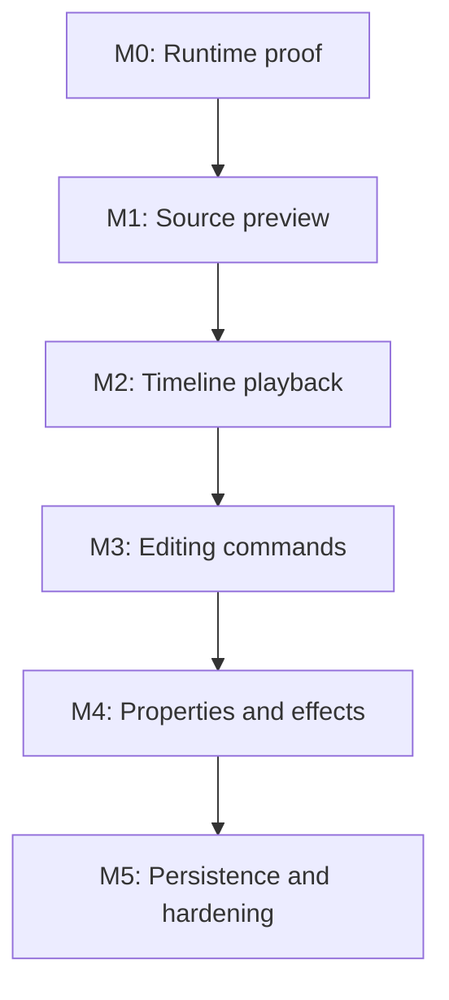
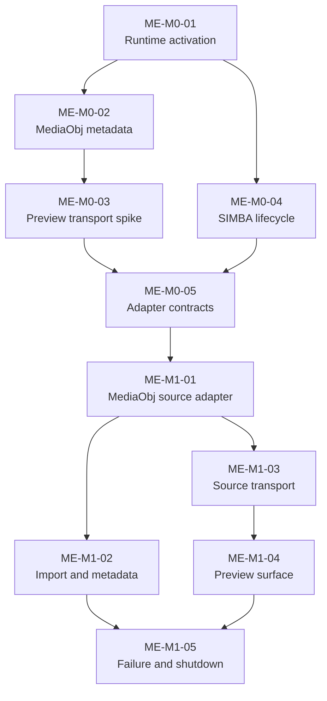

# Issue graph

Ticket IDs are stable and should be used in branch names, commit messages, and
verification evidence. `Depends on` is a hard dependency, not just a preferred
order. The diagrams deliberately show only the decision-level flow and the
implementation-ready work; the ticket tables hold the complete backlog.



## M0 and M1 implementation flow



## Later milestone flow

```text
M2 Timeline playback
  M2-01 Timeline model -> M2-02 SIMBA graph -> M2-03 Transport -> M2-04 Time sync

M3 Editing commands
  M3-01 Command layer -> M3-02 Split/trim -----\
                       -> M3-03 Reorder/ripple --+-> M3-04 Undo/redo

M4 Properties and effects
  M4-01 Property schema -> M4-02 Transform/opacity --\
                         -> M4-03 Fade/effects -------+-> M4-04 Verification

M5 Persistence and hardening
  M5-01 Project format -> M5-02 Save/load/relink -> M5-03 Package -> M5-04 Smoke suite
```

## M0 tickets - detailed

### ME-M0-01 - Add runtime activation probe

Deliverable: a diagnostic component that resolves the staged runtime, records
the exact DLL path and architecture, initializes COM on the owning thread, and
reports activation failures with `HRESULT` and the failed interface name.

Acceptance:

- missing DLL, wrong architecture, class-not-registered, and interface-query
  failures are distinguishable;
- diagnostics contain no user media paths unless explicitly enabled;
- rules `VR-BUILD-01`, `VR-RUNTIME-01`, and `VR-ERROR-01` pass.

### ME-M0-02 - Prove MediaObj metadata extraction

Depends on: `ME-M0-01`.

Deliverable: load one media path through the smallest usable MediaObj interface
and return duration, media type, renderable streams, frame rate when available,
and aspect ratio.

Acceptance:

- the probe unloads before releasing the COM object;
- video, audio-only, image, invalid, and missing paths are covered;
- time units are converted at one adapter boundary;
- rules `VR-MEDIA-01`, `VR-ERROR-01`, and `VR-LIFE-01` pass.

### ME-M0-03 - Select preview transport

Depends on: `ME-M0-02`.

Deliverable: a short-lived spike comparing MediaObj native `HWND` rendering
with `IVideoOutputCallback` or the smallest available output callback.

Measure:

- compatibility with the embedded Qt/QML window hierarchy;
- resize, DPI, clipping, and z-order behavior;
- seek latency and frame ownership rules;
- shutdown behavior while a frame or callback is active;
- effort required to keep QtKit free of proprietary headers.

Acceptance: ADR-0003 records the selected route, rejected route, evidence, and
fallback. Rule `VR-PREVIEW-01` passes for the selected route.

### ME-M0-04 - Prove SIMBA lifecycle

Depends on: `ME-M0-01`.

Deliverable: activate the minimum SIMBA editing interface, query the interfaces
required for M2, create no persistent project state, and release everything on
the owning thread.

Acceptance:

- activation and interface inventory are logged;
- a close request during initialization is safe;
- repeated create/destroy cycles do not hang;
- no cross-thread `SetDisplayWnd(NULL)` teardown is introduced;
- rules `VR-RUNTIME-02` and `VR-LIFE-01` pass.

### ME-M0-05 - Freeze adapter contracts

Depends on: `ME-M0-03`, `ME-M0-04`.

Deliverable: header-only contracts for source media, preview transport, timeline
engine, engine events, and normalized time values. Proprietary types remain
inside implementation files.

Acceptance:

- the UI controller depends only on project-owned interfaces and value types;
- engine callbacks cannot directly mutate QML state;
- ownership and calling thread are documented on each interface;
- ADR-0001 through ADR-0005 are reviewed.

## M1 tickets - detailed

### ME-M1-01 - Implement the MediaObj source adapter

Depends on: `ME-M0-05`. Implement RAII ownership, load/unload, metadata,
transport commands, position queries, and normalized error results.

### ME-M1-02 - Replace filename-only import state

Depends on: `ME-M1-01`. Store a stable media ID, canonical path, media type,
duration, stream capabilities, dimensions/aspect ratio, and load status. Publish
only presentation-safe values to QML.

### ME-M1-03 - Connect source transport controls

Depends on: `ME-M1-01`. Route play, pause, stop, and seek through the adapter.
Use engine position as authority and throttle UI publication.

### ME-M1-04 - Integrate the selected preview surface

Depends on: `ME-M1-03`. Implement the route accepted by ADR-0003, including
resize, DPI, visibility, clipping, audio-only state, and still-image state.

### ME-M1-05 - Harden replacement, failure, and shutdown

Depends on: `ME-M1-02`, `ME-M1-04`. Cover repeated import, failed load,
unsupported stream, close during operations, callback cancellation, unload,
and COM release order. Complete the M1 verification matrix.

## Later milestone tickets - dependency-shaped backlog

| Ticket | Outcome | Depends on |
|---|---|---|
| ME-M2-01 | Native timeline and clip model with stable IDs | ME-M1-05 |
| ME-M2-02 | One-track SIMBA graph builder | ME-M2-01 |
| ME-M2-03 | SIMBA play, pause, stop, and seek adapter | ME-M2-02 |
| ME-M2-04 | Authoritative engine clock and QML playhead sync | ME-M2-03 |
| ME-M3-01 | Command layer and validation boundaries | ME-M2-04 |
| ME-M3-02 | Split and trim commands | ME-M3-01 |
| ME-M3-03 | Reorder and ripple-delete commands | ME-M3-01 |
| ME-M3-04 | Undo/redo transaction stack | ME-M3-02, ME-M3-03 |
| ME-M4-01 | Typed clip-property schema and capability map | ME-M3-04 |
| ME-M4-02 | Scale, position, and opacity integration | ME-M4-01 |
| ME-M4-03 | Fade and curated simple-effect integration | ME-M4-01 |
| ME-M4-04 | Boundary, reset, and playback verification | ME-M4-02, ME-M4-03 |
| ME-M5-01 | Versioned project document format | ME-M4-04 |
| ME-M5-02 | Save/load, missing-media, and relink workflow | ME-M5-01 |
| ME-M5-03 | Clean-clone runtime package verification | ME-M5-02 |
| ME-M5-04 | Scripted release smoke and failure suite | ME-M5-03 |
