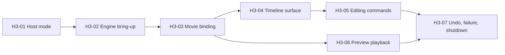

# Homework-3 plan: product-hosted timeline editor

## Status

Proposed 2026-09-22. Homework-3 picks up the timeline-editing scope that
Homework-2 shed when it became a MediaObj source player, and rebuilds it on a
different hosting decision.

## Scope

Homework-3 is a timeline editing surface that runs **inside PowerDirector**:

- a dedicated command-line mode boots PDR into a timeline-homework host,
  reusing the existing headless prelude and message pump;
- the host brings up a real SIMBA engine and binds a working movie;
- a QtKit/QML timeline renders tracks, clips and a playhead from a snapshot;
- add track, add clip, remove clips, and ripple trim run as commands through
  `ITimeline`;
- composed timeline playback previews the edit;
- undo is a revert point, not a bespoke command stack.

There is no launcher, no main panel, no `WorkSpace` reuse, and no standalone
executable.

## Why this shape

Three findings from [SIMBA_INTEGRATION.md](SIMBA_INTEGRATION.md) fix the design
before any code is written:

1. **SIMBA cannot be constructed standalone.** Homework-2 measured it:
   `0xC0000005` at construction, with a byte-identical `SIMBA.dll` present. The
   engine depends on product registry state, CLRC config, a font-manager secret
   key, AC3 init, MUI resources, and a message drain window with a running pump.
   Hosting inside the product is the only route to a live engine.
2. **A timeline abstraction already exists.** `ITimeline` declares the whole
   editing vocabulary, and `HeadlessTimeline` realizes it against SIMBA with no
   UI whatsoever. Homework-3 consumes this rather than inventing a parallel one.
3. **`CSimbaWrapper::Inst()` already has 6,897 call sites.** Adding to that
   number is the specific failure this homework is designed not to commit.

## What this homework is actually teaching

Homework-1 and Homework-2 answered *how does MFC host QML*. Homework-3 answers
a harder question: **how do you add a feature to a codebase whose engine access
is a 12,000-line singleton, without making the coupling worse?**

The deliverable is as much the boundary as the timeline.

## Delivery sequence



| Ticket | Outcome |
|---|---|
| H3-01 | Command-line mode, host window, message pump |
| H3-02 | SIMBA bring-up and ordered teardown |
| H3-03 | Movie binding and `HeadlessTimeline` wiring |
| H3-04 | QML timeline rendering a snapshot |
| H3-05 | Add track, add clip, remove, ripple trim |
| H3-06 | Composed timeline preview playback |
| H3-07 | Revert-point undo, failure paths, clean shutdown |

### H3-01 - Host mode

Add a mode alongside `clpdrMCP` and `clpdrEngineTest` in
`CVideoEditorTLApp::InitInstance`. Reuse the shared prelude verbatim
(`InitMUITransfer` through `MainThreadExecutor::Shared()`), then create the
homework host window instead of a hidden one, then enter the same `GetMessage`
loop. No launcher, main panel, splash, or CICD state.

Unlike the two existing modes the host window is **visible**: it is the MFC
entry point a `CQtModelessController` presents from (ADR-0003).

### H3-02 - Engine bring-up

Follow `EngineTestHostWindow::InitializeSimbaEngine` in order:
`EnsureSimbaCoCreated`, preview frame rate, `SetMessageDrainWindow(m_hWnd)`,
ready event, preview canvas, `EnsureMediaObjWrapperCreated`, then the
`CWnd`-owning singletons on the main thread.

`SetSuppressEditMode(true)` is correct for a headless test and is **not**
assumed correct here; H3-02 records which setting an interactive editing
session needs and why.

A failed bring-up must leave a usable shell with an actionable diagnostic, not
a crash or a silent empty timeline.

**Finding from H3-01, and a problem for this ticket.** After running the mode
end to end, no PDR log file appeared anywhere under `AppData`. The host's
`LOGGER_INFO` calls are compiled in and the code path demonstrably ran, so the
prelude evidently does not stand up the file logger the full application does
(`InitBoomerang` is not on this path). "Actionable diagnostic" therefore cannot
mean `LOGGER_ERROR` alone -- on this path that may go nowhere retrievable.
H3-02 must either initialize the logger for this mode or surface bring-up
failure somewhere the user actually sees, and say in its evidence which it did.

### H3-03 - Movie binding

Create a working movie through `IMovieHost` / `SimbaMovieHost`, bind
`HeadlessTimeline` to it, and scope every write with `MovieScope`. The bound
movie id is named on every operation; the current movie is never switched out
from under the host.

### H3-04 - Timeline surface

QML renders `ITimeline::snapshot()`: tracks, clips with start/duration, and a
playhead. Clips and tracks are addressed by the stable ids the snapshot
carries, never by QML list index.

QML follows `docs/common/qml-guidelines.md` (theme system, image naming,
AutoTestId, binding pattern) and lives in the product resource pipeline, per
ADR-0003.

**A footnote, not a dependency.** Homework-2 sketched a timeline QML surface
before it narrowed to a source player, and the media-player pivot deletes it
(`git show HEAD:mini_editor_demo/qml/Timeline/` in the qt-homework repo, 194
lines across three files). It is recorded here only so nobody re-discovers it
later and wonders whether it mattered. It does not: it renders a project-owned
model rather than an engine snapshot, and it predates the product QML
conventions this ticket must follow. Write this surface fresh.

### H3-05 - Editing commands

`addTrack`, `addClip`, `removeClips`, `trimClipRippleAll`. QML emits intent;
the controller turns intent into one `ITimeline` call; the snapshot is re-read
and re-rendered. QML never holds a SIMBA or `CTLObject` type.

Every engine call is `HRESULT`-checked and a failure surfaces in the UI. An
unconditional success return is the defect this ticket exists to avoid.

### H3-06 - Preview playback

Play the composed timeline into the preview canvas. Engine position is
authoritative; the UI does not invent playback progress.

### H3-07 - Undo, failure, shutdown

Undo is `armRevertPoint` / `revertToPoint` / `commitRevertPoint`, not a custom
command stack. Plus: invalid media, failed engine calls, close during playback,
and repeated open/edit/close cycles with no surviving process.

## Out of scope

Effects, transitions, titles, subtitles, stickers, keyframes, project
persistence, produce/export, 360, and any `WorkSpace` reuse. Multi-clip
composition beyond the four commands in H3-05.

## Verification

| Rule | Requirement |
|---|---|
| VR-HOST-01 | The mode boots, brings up SIMBA, and pumps messages without launcher or main panel. |
| VR-HOST-02 | A failed engine bring-up yields a diagnostic and a usable shell, not a crash. |
| VR-BIND-01 | Every timeline write names the bound movie; the current movie is never switched. |
| VR-RENDER-01 | The QML timeline matches `snapshot()` after every command, addressed by stable id. |
| VR-EDIT-01 | Each of the four commands changes engine state, confirmed by product read-back. |
| VR-EDIT-02 | A failing engine call surfaces as a UI error, never as a silent success. |
| VR-PREVIEW-01 | Preview position follows the engine, across play, pause, and seek. |
| VR-UNDO-01 | A revert point restores the timeline to its pre-command state. |
| VR-LIFE-01 | Twenty open/edit/close cycles leave no hang and no surviving process. |
| VR-COUPLING-01 | Homework-3 code adds no new `CSimbaWrapper::Inst()` call site outside the host bring-up. |

`VR-COUPLING-01` is mechanically checkable and is the rule most worth keeping
honest:

```bash
grep -rn "CSimbaWrapper::Inst()" <homework-3 sources> | wc -l
```
